<div align="center">

[](https://github.com/SethGammon/Citadel/actions/workflows/tests.yml)
[](LICENSE)

[](https://sethgammon.github.io/Citadel/)

# Citadel

**An open-source operating layer for Claude Code and OpenAI Codex.**

Citadel routes requests, preserves repository state between sessions,
coordinates parallel work, applies repository safeguards, and records evidence
and handoffs around the coding agent you already use.

[Install](#install) · [Start using it](#start-using-it) · [Trust boundary](#trust-boundary) · [Documentation](#documentation)

</div>

## Install

**Requires:** Claude Code or OpenAI Codex, Node.js 18+, and a git repository.

GitHub Releases are the only supported stable acquisition channel. Choose an
explicit version and use its complete archive, external manifest, and SHA-256
sidecar. The public npm package named `citadel` is unrelated to this project,
and floating `main` is development source rather than a stable install.

Open the repository you want Citadel to manage, then paste this into your
coding agent:

```text
Install Citadel in this repository from a tagged GitHub Release at
https://github.com/SethGammon/Citadel/releases.

Choose an explicit vX.Y.Z release. Download all three matching assets:
citadel-vX.Y.Z.tar.gz, citadel-vX.Y.Z.tar.gz.manifest.json, and
citadel-vX.Y.Z.tar.gz.sha256. Verify that the archive SHA-256 agrees with both
the sidecar and external manifest before extracting it. Do not use npm and do
not install from floating main.

Detect whether this session is running in OpenAI Codex or Claude Code. Use the
extracted citadel-X.Y.Z directory as the source and this repository as the
target. Create a governed adoption plan for that runtime. Show me the exact
footprint, unknown external registrations, plan digest, and confirmation token
before applying anything. After I approve the saved plan, apply it and run
adoption doctor.

After adoption is healthy and Citadel is enabled in a fresh thread, run:

/do setup --express
```

The agent must stop at the saved adoption plan until you approve its exact
confirmation token. Follow any external plugin-enable step still reported as
unknown, start a fresh session if prompted, then run `/do setup --express`.

<details>
<summary><strong>Manual stable installation</strong></summary>

<br>

1. Open the [GitHub Releases](https://github.com/SethGammon/Citadel/releases)
   page and choose an explicit `vX.Y.Z` release.
2. Download `citadel-vX.Y.Z.tar.gz`, its `.manifest.json`, and its `.sha256`
   sidecar into one directory.
3. Compare the archive's SHA-256 with both published values before extraction.
   A missing asset or mismatch is a blocked install.
4. Extract the archive, then use its single `citadel-X.Y.Z/` directory as the
   immutable source for the governed adoption plan.

From the target repository, with `CITADEL_ROOT` pointing at that extracted
directory, the compact Linux/macOS form is below. Windows users should use the
quoted `$env:CITADEL_ROOT` PowerShell path in [Installation](INSTALL.md).

```bash
node "$CITADEL_ROOT/scripts/adopt.js" plan "$CITADEL_ROOT" \
  --target . --project-runtime codex \
  --out ../citadel-adoption.plan.json --json

node "$CITADEL_ROOT/scripts/adopt.js" apply ../citadel-adoption.plan.json \
  --confirm <plan-token> --json

node "$CITADEL_ROOT/scripts/adopt.js" doctor --target . --json
```

Use `--project-runtime claude` for Claude Code or `both` only when both runtime
projections are intentional. Runtime-specific enable steps are in
[Installation](INSTALL.md).

Keep every saved plan outside the target repository. Writing the plan inside
the target changes the preflight snapshot and causes apply to reject
`TARGET_DRIFT`.

</details>

For contributor testing only, a source checkout may use
`git clone --branch main https://github.com/SethGammon/Citadel.git`. That path
is development-only: it has no release trio or immutable version boundary and
must not be presented as a stable install.

See [Installation](INSTALL.md) for platform-specific checksum commands,
runtime enable steps, rollback, and uninstall. See [Releases](docs/RELEASES.md)
for the artifact and provenance contract.

## Start using it



Start with `/do` and describe the outcome:

```text
/do review README.md
/do generate tests for the changed files
/do preview build a caching layer
/do next
```

Exact commands resolve only when the normalized whole request matches. The
project commands `/do test`, `/do build`, and `/do typecheck` additionally
require the corresponding non-empty target `package.json` script. Larger
requests collect generated candidates and then require runtime semantic
classification.

`/do preview` shares only the exact-command and built-in candidate preflight.
It does not inspect active state, discover project-local skills, or run the
runtime LLM classifier. Every natural-language preview is non-executable:
`selected` and `command` are null, `canRunNow` is false, and the boundary is
`semantic-classification-required`.

If you already know the destination, a validated override is available without
bypassing activation or safety boundaries:

```text
/do --route /test-gen -- generate tests for the changed files
```

The operating loop uses five public states:

| State | What it means |
|---|---|
| **Request** | You describe the outcome through `/do` or a known skill. |
| **Run** | The selected workflow acts within runtime, repository, and approval boundaries. |
| **Evidence** | Checks and artifacts report `passed`, `failed`, `blocked`, or `unknown`. |
| **Needs You** | Citadel stops with the exact approval, conflict, or missing evidence required. |
| **Resume** | Repo-local state names the next useful action for a fresh session. |

## When Citadel is useful

Citadel is most useful when coding-agent work extends beyond one prompt:

| You are dealing with... | Citadel adds... |
|---|---|
| Repeated setup and lost context | Repo-local decisions, discoveries, and handoffs |
| Unclear workflow choice | One natural-language entry point through `/do` |
| Risky or multi-step changes | Approval boundaries and explicit verification |
| Several agents or branches | Isolated worktrees, ownership, and shared discoveries |
| Work interrupted between sessions | Durable state and a concrete resume action |

For a short one-off edit, your coding agent may already be enough. Citadel does
not replace `CLAUDE.md`, `AGENTS.md`, branch protection, or human review.

## Evidence status

Citadel publishes positive and negative outcomes from the same evidence
contract. Its v1 experiment does not support a savings claim: one matched
baseline timeout drove the aggregate advantage, and excluding that pair
reversed the economic direction. A later capability-profile run preserved the
verified rate but used more measured GPU energy. A representative fixture
shakedown reached 6/12 verified cells with zero false passes, but missed its
frozen energy gate. The [research site](https://sethgammon.github.io/Citadel/research.html)
publishes the bounded results and limitations together.

## Trust boundary

- Citadel runs with the permissions of Claude Code or Codex. It is not a
  sandbox and does not replace code review or branch protection.
- Verification reports `passed`, `failed`, `blocked`, or `unknown`. Missing
  evidence is not promoted to success.
- Project state and telemetry stay local by default. Citadel does not commit,
  push, or transmit them automatically.
- The automated suite validates Citadel's contracts and fixtures. It does not
  guarantee the quality of agent-written code.

Read [Security](SECURITY.md) and [Privacy](PRIVACY.md) before enabling Citadel in
a sensitive repository.

## Documentation

The stable release intentionally ships a small public documentation surface:

| Goal | Document |
|---|---|
| Acquire, install, update, roll back, or remove Citadel | [Installation](INSTALL.md) |
| Verify release archives and provenance | [Releases](docs/RELEASES.md) |
| Understand exact commands, candidates, and preview limits | [Routing Preview](docs/ROUTING_PREVIEW.md) |
| Understand runtime, state, and orchestration boundaries | [Architecture](docs/ARCHITECTURE.md) |
| Use package commands and supported flags | [CLI reference](docs/CLI.md) |
| Review shipped changes | [Changelog](CHANGELOG.md) |

The extracted release includes <!-- GENERATED: skill-count -->49<!-- /GENERATED --> workflows and <!-- GENERATED: hook-script-count -->35<!-- /GENERATED --> hook scripts across <!-- GENERATED: hook-event-count -->29<!-- /GENERATED --> lifecycle events. They are an internal catalog, not a prerequisite checklist.

Citadel keeps operational state separate from application code:

```text
.planning/                 Campaigns, runs, evidence, handoffs, and telemetry
.citadel/scripts/          Project-local coordination and reporting utilities
.claude/agent-context/     Rules supplied to delegated agents
.claude/harness.json       Project configuration generated by setup
```

## Common questions

**Does Citadel work on Windows?**

Yes. Hooks and scripts run on Node.js, and the Codex installer includes Windows
readiness checks.

**How do I remove it?**

Use `/unharness` to create a receipt-owned leave plan, review the exact
footprint, and apply it with the plan token. Legacy installs are inventoried
first and cannot claim exact removal. See [Installation](INSTALL.md).

**Where should I report a problem?**

Use [GitHub Discussions](https://github.com/SethGammon/Citadel/discussions) for
questions or [GitHub Issues](https://github.com/SethGammon/Citadel/issues) for
reproducible defects.

[MIT License](LICENSE)
